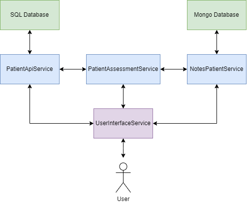

# MediScreen

The Mediscreen application is a medical screening and patient management system. 
It is designed to facilitate medical professionals in managing patient data and medical notes efficiently. 
The application consists of multiple micro-services, each responsible for specific functionalities.

## Note

In order to simplify the application's code and facilitate maintenance, 
slight modifications have been made to the queries provided for adding notes, replacing the "¬" symbols with "&".

## Micro-Services

The Mediscreen application comprises the following micro-services:

* Patient API Service: This micro-service provides endpoints to manage patient data, 
  including adding, updating, and deleting patient records. 
  It is responsible for handling patient-related operations.

* Notes Patient Service: This micro-service manages medical notes for patients. 
  It allows medical professionals to add, update, and delete medical notes associated with specific patients.

* User Interface Web Service: This micro-service provides a user interface for medical professionals to interact
  with the system. It enables them to manage patient data, view medical notes, 
  and perform various patient-related tasks.

## Diagram



## Running the Application

### With Docker

To run the MediScreen application with Docker, follow these steps:

1. Make sure you have Docker installed.

2. Navigate to the root directory of the Mediscreen application.

3. Execute the following command to start all the micro-services using Docker:
```
	docker-compose up
```
4. Docker will pull the necessary images and start the containers for each micro-service.

5. The application will start.
	- user-interface running on http://localhost:8080.
	- patient-api running on http://localhost:8081.
	- notes-patient running on http://localhost:8082.

### By Running Micro-Services Individually

1. Make sure to run each micro-service by following the steps in their respective readme.

2. The application will start.
	- user-interface running on http://localhost:8080.
	- patient-api running on http://localhost:8081.
	- notes-patient running on http://localhost:8082.

## Endpoints and APIs

Each micro-service exposes specific endpoints and APIs for different functionalities. 
Refer to the respective micro-service's README for detailed information on the available endpoints and APIs.

